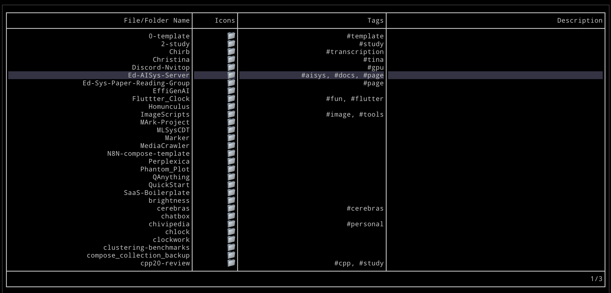

# Lanno


## What is Lanno?

Lanno is a command-line tool designed to enhance code organization and documentation by providing annotations for files, akin to using the `ls` command but with additional metadata.



## Why Do I Need Annotations?

### TL;DR:

While tools like Copilot are great for auto-completing code, they often fall short in organizing code structure. Lanno simplifies this process by offering a more straightforward solution. It aims to streamline end-to-end project training by providing comprehensive information about each file.

### Detailed Explanation:

- **Improved Code Structure:** Lanno helps maintain a clean and well-documented codebase by allowing you to annotate files with tags and descriptions, making it easier to understand the role of each file at a glance.
- **Ease of Collaboration:** Sharing projects with colleagues or friends can be cumbersome when they're unfamiliar with the purpose of each file. Lanno allows users to document file usage efficiently, eliminating the need to painstakingly explain each file's function individually.
- **Enhanced Documentation:** Sometimes, writing detailed documentation for every file is time-consuming. Lanno provides a quick way to add relevant information directly to the files, making it accessible and less likely to be overlooked.

## How to Use Lanno

### Viewing Annotations

To view annotations for files, simply run:

```bash
lanno
```

This command will list all files in the directory along with their associated annotations.

### Adding or Removing Tags

You can add or remove tags for a file using the following command format:

```bash
lanno file +tag1 +tag2 -tag3
```

- `+tag`: Adds a tag to the file.
- `-tag`: Removes a tag from the file.

### Adding Descriptions

To add a description to a file, use the following command format:

```bash
lanno file "This is a description"
```

This will attach the provided description to the specified file.

### Example Usage

1. **View Annotations:**
    ```bash
    lanno
    ```
    This will display a list of files with their annotations.

2. **Add Tags to a File:**
    ```bash
    lanno example.py +script +utility
    ```
    This will add the tags `script` and `utility` to `example.py`.

3. **Remove a Tag from a File:**
    ```bash
    lanno example.py -utility
    ```
    This will remove the tag `utility` from `example.py`.

4. **Add a Description to a File:**
    ```bash
    lanno example.py This script processes data.
    ```
    This will add the description "This script processes data." to `example.py`.


---

By using Lanno, you can ensure your projects are well-documented and easily understandable by anyone who accesses your code. Happy coding!

## Features

- Tag files with custom labels
- Add descriptions to files
- Interactive file browser with search capabilities
- Command-line interface for quick tagging

## Usage

### Command Line

```bash
lanno <file> <command>
```

Commands:
- `+<tag>` - Add a tag to a file
- `-<tag>` - Remove a tag from a file
- `<description>` - Set description for a file (use empty string to remove)

Examples:

```bash
lanno document.txt +work     # Add #work tag to document.txt
lanno document.txt -work     # Remove #work tag from document.txt
lanno document.txt "Important work document"  # Set description
lanno document.txt +urgent "Important work document"  # Add tag and description
lanno document.txt ""        # Remove description
```

### Interactive Mode

Launch the interactive file browser:
```
lanno
```

Navigation:
- Arrow keys to navigate files
- `/` to search files
- `ctrl+e` to edit selected file's tags or description
- `f5` or `r` to refresh the file list
- `q` or `ctrl+c` to quit

When editing (after pressing `ctrl+e`):
- Type commands like `+tag` to add tags
- Type `-tag` to remove tags
- Type any text without `+` or `-` prefix to set description
- Press Enter to submit
- Press Esc to cancel

## File Format

Lanno stores file metadata in a `.lanno.json` file in the current directory.
